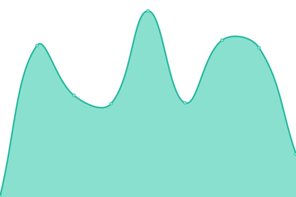
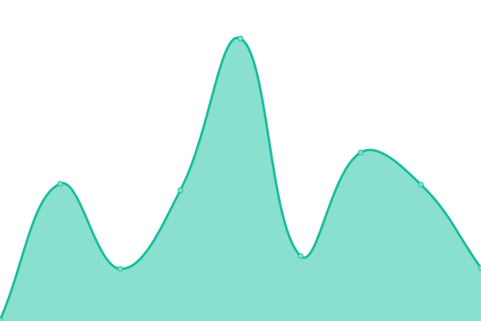

# [📈 Live Status](https://status.givpn.my.id): <!--live status--> **🟩 All systems operational**

This repository contains the open-source uptime monitor and status page for [givps](https://install.givpn.my.id), powered by [Upptime](https://github.com/upptime/upptime).

With [Upptime](https://upptime.js.org), you can get your own unlimited and free uptime monitor and status page, powered entirely by a GitHub repository. We use [Issues](https://github.com/givps/status/issues) as incident reports, [Actions](https://github.com/givps/status/actions) as uptime monitors, and [Pages](https://status.givpn.my.id) for the status page.

<!--start: status pages-->
<!-- This summary is generated by Upptime (https://github.com/upptime/upptime) -->
<!-- Do not edit this manually, your changes will be overwritten -->
<!-- prettier-ignore -->
| URL | Status | History | Response Time | Uptime |
| --- | ------ | ------- | ------------- | ------ |
|  [Status](https://status.givpn.my.id) | 🟩 Up | [status.yml](https://github.com/givps/status/commits/HEAD/history/status.yml) | 

 307ms
     
 | 

<a href="https://status.givpn.my.id/history/status">100.00%</a>
    

|  [Install](https://install.givpn.my.id) | 🟩 Up | [install.yml](https://github.com/givps/status/commits/HEAD/history/install.yml) | 

 251ms
     
 | 

<a href="https://status.givpn.my.id/history/install">100.00%</a>
    

|  [Crypto](https://crypto.givpn.my.id) | 🟩 Up | [crypto.yml](https://github.com/givps/status/commits/HEAD/history/crypto.yml) | 

 269ms
     
 | 

<a href="https://status.givpn.my.id/history/crypto">100.00%</a>
    

|  [Openclash](https://openclash.givpn.my.id) | 🟩 Up | [openclash.yml](https://github.com/givps/status/commits/HEAD/history/openclash.yml) | 

 257ms
     
 | 

<a href="https://status.givpn.my.id/history/openclash">100.00%</a>
    

<!--end: status pages-->

[**Visit our status website by upptime→**](https://status.givpn.my.id)

## or

[**Visit our status website by uptimerobot→**](https://stats.uptimerobot.com/jwMlPilyGm)

## 📄 License

- Powered by: [Upptime](https://github.com/upptime/upptime)
- Code: [MIT](./LICENSE) © [Anand Chowdhary](https://anandchowdhary.com), supported by [Pabio](https://pabio.com)
- Data in the `./history` directory: [Open Database License](https://opendatacommons.org/licenses/odbl/1-0/)
